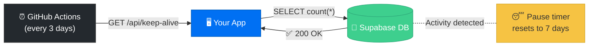
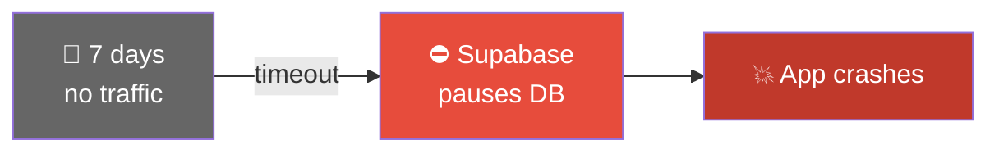

# Supabase Keep-Alive

**Prevent Supabase free tier from pausing your database.**

Supabase free tier pauses your project after 7 days of inactivity. This repo provides a zero-cost, zero-maintenance solution using a simple API endpoint + GitHub Actions.

---

## The Problem

If you're using Supabase on the free plan, you've probably received this email:

> *"Your project has not seen sufficient activity for more than 7 days and is scheduled to be paused..."*

No traffic for a week → Supabase shuts down your database → your app breaks.

## The Solution

A lightweight keep-alive system that pings your database every 3 days:



### Without Keep-Alive


**3 files. 0 cost. Fully automated.**

---

## Setup (Next.js + GitHub Actions)

### 1. Create the API Endpoint

Create `src/app/api/keep-alive/route.ts`:

```ts
import { NextRequest, NextResponse } from "next/server";
import { createClient } from "@/lib/supabase/server";

export async function GET(req: NextRequest) {
  const authHeader = req.headers.get("authorization");
  const token = authHeader?.replace("Bearer ", "");
  const cronSecret = process.env.CRON_SECRET;

  if (!token || token !== cronSecret) {
    return NextResponse.json({ error: "Unauthorized" }, { status: 401 });
  }

  try {
    const supabase = await createClient();
    const { count, error } = await supabase
      .from("your_table_name")
      .select("*", { count: "exact", head: true });

    if (error) {
      return NextResponse.json(
        { status: "error", message: error.message },
        { status: 500 }
      );
    }

    return NextResponse.json({
      status: "ok",
      timestamp: new Date().toISOString(),
      row_count: count,
    });
  } catch {
    return NextResponse.json(
      { status: "error", message: "Failed to reach database" },
      { status: 500 }
    );
  }
}
```

> Replace `"your_table_name"` with any table in your Supabase project.

### 2. Add CRON_SECRET

Add to your `.env`:

```env
CRON_SECRET=any-random-secret-string
```

Add the same value to your hosting provider's environment variables (Render, Vercel, etc.).

### 3. Create GitHub Actions Workflow

Create `.github/workflows/keep-alive.yml`:

```yaml
name: Supabase Keep-Alive

on:
  schedule:
    - cron: '0 8 */3 * *'  # Every 3 days at 8:00 AM UTC
  workflow_dispatch:        # Allow manual trigger

jobs:
  ping:
    runs-on: ubuntu-latest
    steps:
      - name: Ping keep-alive endpoint
        run: |
          response=$(curl -s -w "\n%{http_code}" \
            -H "Authorization: Bearer ${{ secrets.CRON_SECRET }}" \
            https://YOUR-APP-URL/api/keep-alive)

          http_code=$(echo "$response" | tail -1)
          body=$(echo "$response" | head -1)

          echo "Status: $http_code"
          echo "Response: $body"

          if [ "$http_code" != "200" ]; then
            echo "Keep-alive ping failed!"
            exit 1
          fi
```

> Replace `YOUR-APP-URL` with your deployed app URL.

### 4. Add GitHub Secret

1. Go to your repo **Settings > Secrets and variables > Actions**
2. Click **New repository secret**
3. Name: `CRON_SECRET`
4. Value: same as in your `.env`

### 5. Test

1. Go to **Actions** tab in your repo
2. Select **Supabase Keep-Alive**
3. Click **Run workflow**
4. Green checkmark = working

---

## How It Works

| Component | Purpose |
|-----------|---------|
| `/api/keep-alive` | Endpoint that queries Supabase to generate activity |
| `CRON_SECRET` | Bearer token to prevent unauthorized access |
| GitHub Actions cron | Calls the endpoint automatically every 3 days |

Supabase pauses after **7 days** of inactivity. Pinging every **3 days** keeps a safe margin.

The query is lightweight (`SELECT count(*) ... head: true`) — no performance impact.

---

## Other Frameworks

The concept works with any stack:

| Framework | Endpoint |
|-----------|----------|
| Next.js (App Router) | `src/app/api/keep-alive/route.ts` |
| Next.js (Pages Router) | `pages/api/keep-alive.ts` |
| Express | `app.get('/api/keep-alive', ...)` |
| FastAPI (Python) | `@app.get("/api/keep-alive")` |
| Flask (Python) | `@app.route("/api/keep-alive")` |

---

## Alternative Cron Services

If you don't want to use GitHub Actions:

| Service | Free? | Notes |
|---------|-------|-------|
| [cron-job.org](https://cron-job.org) | Yes | Simple web UI |
| [UptimeRobot](https://uptimerobot.com) | Yes | Also monitors uptime |
| Render Cron Jobs | Paid | Built into Render |

---

## Claude Code Skill

If you use [Claude Code](https://claude.ai/claude-code), this repo includes a ready-made skill. Copy the `.claude/skills/supabase-keep-alive/` folder into your project and run `/supabase-keep-alive` — Claude will set up everything automatically.

---

## License

MIT — use it however you want.
